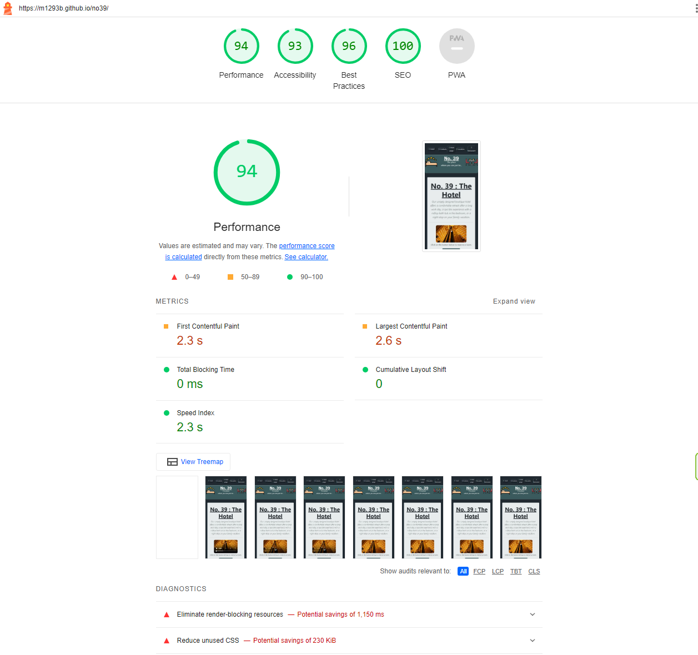

1. # UX

   ***

  - ## Project goals
    
    The goal of my first project is to display a website of a property that offers multiple venues. Also, to give the opportunity to the user to be able to reserve a room, and a table in the restaurant as part of their visit.

  - ## Design choices

    While watching the "I love running" videos, I found the curved borders be more appealing. Made the experience "lighter", more enjoyable to look at than sharp corners. I tried to implement this feature as much as I could to make the user feel more relax in a way that, if needed, they could spend more time reading through the lines or looking at pictures. I believe it is important to showcase the feeling of the product, in this case a hotel and a restaurant, that we want to advertise.

  - ## Business goals
    
    As a company that offers multiple venues at its property, I would like to give the opportunity for the potential guest to combine the two experiences.

  - ## Developer goals

    I wanted the business to achive its goal by simplifying the way how the user finds the options. I added the links to features that invites the user to buy vouchers, so e.g. family members could surprise their beloved with a present during the festive period. I have also added the option to buy packages, that include an overall discount on the total price, and makes it simpler for the potential guests to organise their stay.

  - ## Wireframes

    

2. # Features
   
   ***

  - ## Existing features
    
    * Being able to see opening times.
    * Get a better feel of the venues the property offeres.
    * Booking form for both venues - which will need to be improved as more knowledge becomes available throughout the course.
    * Location section, to help potential guests to find the venues.
    * Contact details, to give the opportunity to potential guests to enquire.

  - ## Features left to be implemented
    
    * A database, to process and store data that the user sent via the booking form.
    * Dynamic menu system - which will be adding more quality to UX.

3. # Technologies used

   ***

  - Bootstrap

4. # Bugs

   ***

    It felt quite difficult to understand how the positioning works. The Chrome developer tool proved to be quite useful, as taught, and helped me solved the issues I had in the nav element quite quickly.
    I also tried to make this links and the div they are in responsive. Some of the solutions were creater without the need of a media quiery, then I found it to be useful for other parts.

    I spent quite some time solving the issue with the positioning of the links in the nav element. I found wraping each anchor tag in a div makes it easier to position them. The final issue with the positioning of the anchor tags was aligning them. This is when Chrome's developer tool came in handy, as with the display attribute, it gave me the option to try out different values via a little button next to it.
    This got me the solution with the justify-content and align-items being set with the correct values.

    As I did not want to paste in all of the section from the css file, this is an example how I managed to display the anchor tags in a way that fit the design:

    <!--
    #nav-box-contacts { 
        display: inline-flex;
        width: 33%;
        float: left;
        justify-content: space-evenly;
        align-items: center;
        } 
    -->

5. # Testing    

    ***

      - 
      - 

      It seems to me that the biggest improvement could be done by downloading the bootstrap css, adding it to the assets folder and link it to the html file that way. Less loading time. I will include this solution in my next project.

      ### I had to download the css files, as while testing the live website, the css file would not load.

6. # Credits
   
   ***

    1. ## Content

      - [The colours used for the website were found on colorhunt.com](https://colorhunt.co/palette/22283131363f76abaeeeeeee)

    2. ## Media

     - [The picture of the hotel room was found on Pexels.com. Direct link to the page I downloaded the picture from](https://www.pexels.com/photo/black-and-grey-bedspread-on-bed-and-pillow-164595/): 
     - [The video that is playing in the hotel's section, was downloaded from Pexels.com](https://www.pexels.com/video/elevators-going-up-and-down-855191/)
     - [The video that is playing in the restaurant's section, was downloaded from Pexels.com](https://www.pexels.com/video/people-eating-a-meal-at-the-restaurant-5101342/)
     - [The picture of the wineglass held up was found on Pexels.com. Direct link to the page I downloaded the picture from](https://www.pexels.com/photo/wine-glass-on-restaurant-table-225228/)
     - [The icon for the hotel was found on flaticon.com](https://www.flaticon.com/free-icon/bed_1786937?term=hotel+room&page=1&position=23&origin=search&related_id=1786937)
     - [The icon for the hotel was found on flaticon.com](https://www.flaticon.com/free-icon/dinner_9954957?term=restaurant&page=1&position=48&origin=search&related_id=9954957)
     - [Font-awesome icon was used within the anchor tag for the hotel's link](https://fontawesome.com/icons/bed?f=classic&s=solid)
     - [Font-awesome icon was used within the anchor tag for the contacts' link](https://fontawesome.com/icons/phone?f=classic&s=solid)
     - [Font-awesome icon was used within the anchor tag for the main page's link](https://fontawesome.com/icons/house?f=classic&s=solid)
     - [Font-awesome icon was used within the anchor tag for the location's link](https://fontawesome.com/icons/location-dot?f=classic&s=solid)
     - [Font-awesome icon was used within the anchor tag for the restaurants's link](https://fontawesome.com/icons/utensils?f=classic&s=solid)
  
    3. ## Code
   
     - I've got the idea of margin: 0 auto; from the "I love running" project. It is an easy way to devide the width of the screen by 3 equaly sized sections.
     - I've used form-group from Bootstrap's website as a template for my booking forms.
