# Table of content:

  ## UX
  - User stories
  - Project goals
  - Design choices
  - Business goals
  - Developer goals
  - Wire frames

  ## Features
  - Existing features
  - Features left to be implemented

  ## Technologies used

  ## Bugs

  ## Testing
  - Testing with validators
  - Manual testing
  - Restaurant booking form testing
  - Hotel booking form testing

  ## Credits
  - Content
  - Media
  - Code

***

# UX

  - ## User stories
  
    1.  First time visitor goals:
  
      - As a first time visitor, I would like to be able to understand what is the purpose of the website.
      - As a first time visitor, I would like to be able to easily navigate through the pages.
      - As a first time visitor, I would like to be able to find the location information.

    2.  Returning visitor goals:

      - As a returning visitor, I would like to be able to comfortably find the previously visited sites.
      - As a returning visitor, I would like to be able to be able to find the contact details, regardless which page I am viewing.
      - As a returning visitor, I would like to be able to find other experiences the venue offers.
  
    3.  Frequent visitor goals:

      - As a frequent visitor, I would like to be able to easily find out if there are any updates on the packages.
      - As a frequent visitor, I would like to be able to see the restaurant opening times.
      - As a frequent visitor, I would like to be able to easily book a room or a table for my party.

  - ## Project goals
    
    The goal of my first project is to display a website of a property that offers multiple venues. Also, to give the opportunity to the user to be able to reserve a room, and a table in the restaurant as part of their visit.

  - ## Design choices

    While watching the "I love running" videos, I found the curved borders be more appealing. Made the experience "lighter", more enjoyable to look at than sharp corners. I tried to implement this feature as much as I could to make the user feel more relax in a way that, if needed, they could spend more time reading through the lines or looking at pictures. I believe it is important to showcase the feeling of the product, in this case a hotel and a restaurant, that we want to advertise.

  - ## Business goals
    
    As a company that offers multiple venues at its property, I would like to give the opportunity for the potential guest to combine the two experiences.

  - ## Developer goals

    I wanted the business to achive its goal by simplifying the way how the user finds the options. I added the links to features that invites the user to buy vouchers, so e.g. family members could surprise their beloved with a present during the festive period. I have also added the option to buy packages, that include an overall discount on the total price, and makes it simpler for the potential guests to organise their stay.

  - ## Wireframes

    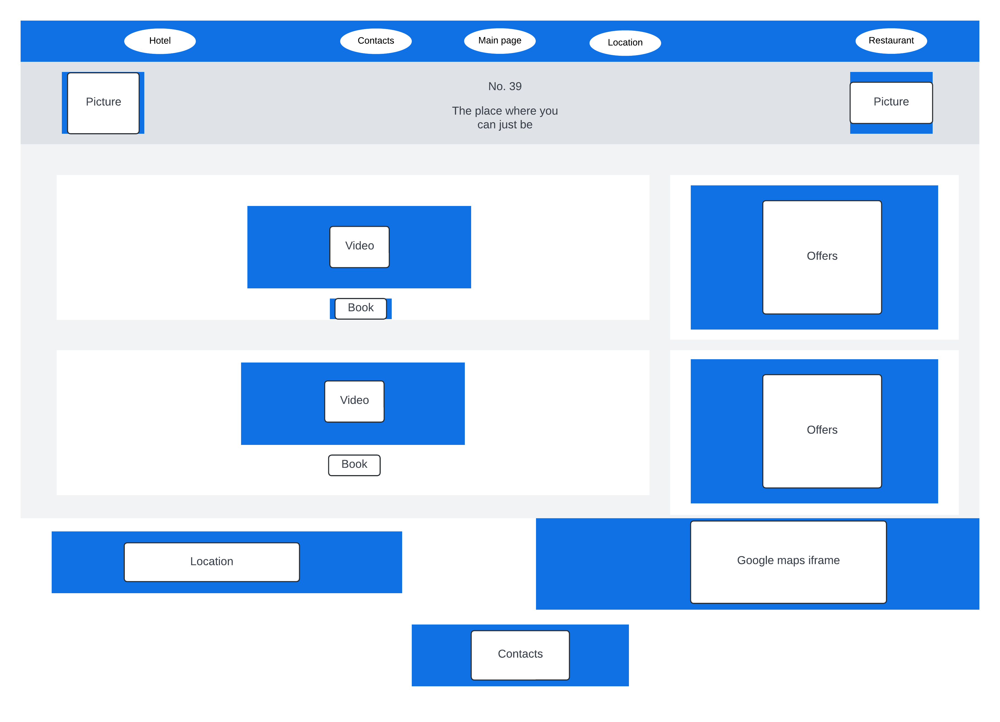
    
    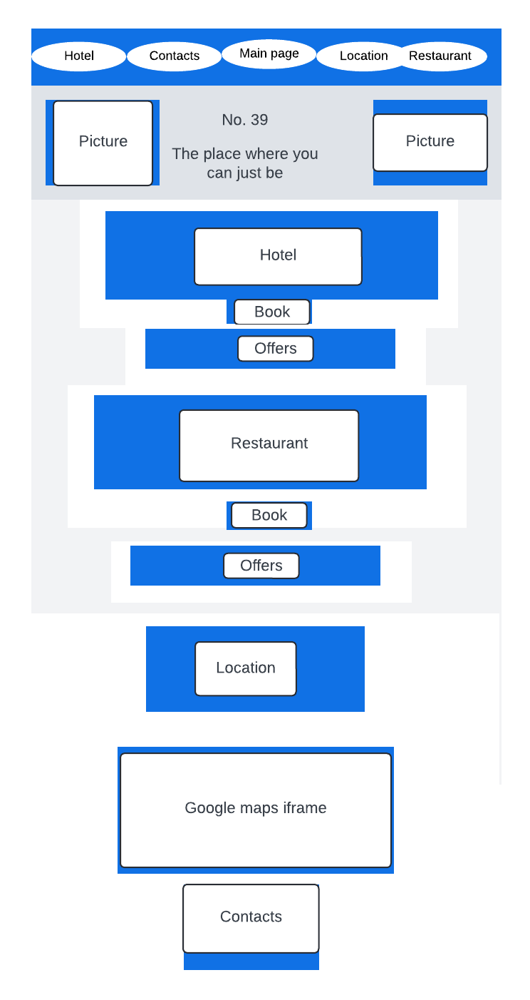
    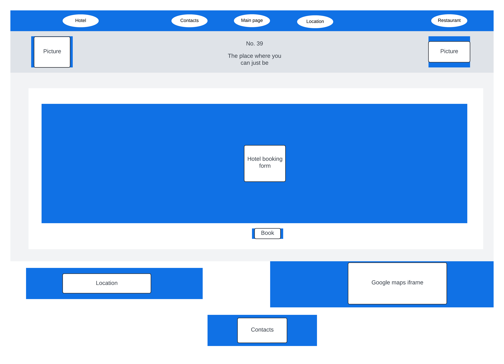
    
    
    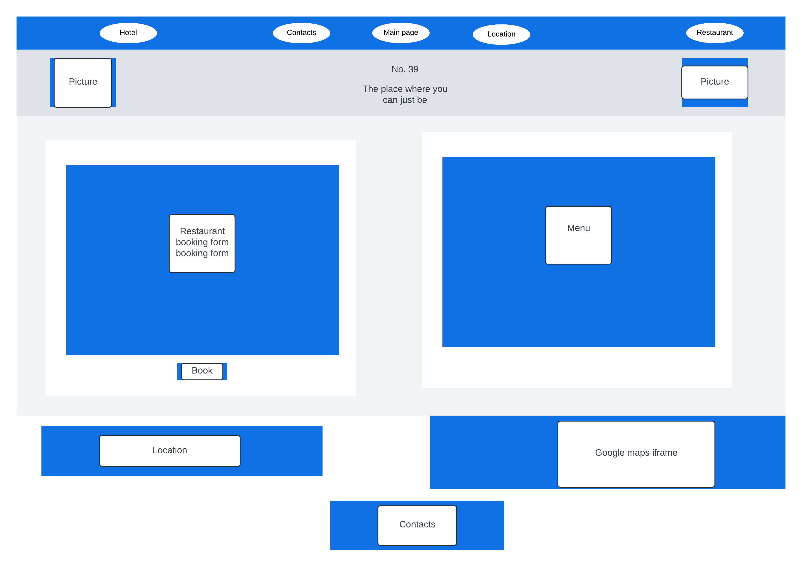
    
    

# Features
   

  - ## Existing features
    
  * Being able to see opening times.
  * Get a better feel of the venues the property offeres.
  * Booking form for both venues - which will need to be improved as more knowledge becomes available throughout the course.
  * Location section, to help potential guests to find the venues.
  * Contact details, to give the opportunity to potential guests to enquire.

  - ## Features left to be implemented
    
  * A database, to process and store data that the user sent via the booking form.
  * Dynamic menu system - which will be adding more quality to UX.
  

# Technologies used

  1. Languages used:

  - HTML
  - CSS

  2. Frameworks, Libraries & Programs Used:

  - Bootstrap - Used to create boxes for the main and footer sections.
  - GitHub - Used for making my files available on the web.
  - FontAwesome - Used for decorating the navigation buttons

  3. Websites used

  - [The website I used to check if my website is responsive. I also included a screenshot in the testing section.](https://ui.dev/)
  - [I used Bootstrap's website a lot, especially to get a better idea how to align items.](https://getbootstrap.com/)
  - [I used this website to find the colour I felt comfortable using with eachother.](https://colorhunt.co)
  - [I used Pexels to find appropriate photos and videos to fit in the subject of my website.](https://www.pexels.com)
  - [I used FontAwesome to find lttle icons to decorate the buttons in the nav bar.](https://fontawesome.com)
  - [I used Flaticon to find lttle icons to replace the bigger pictures in the header once they would be too big on a smaller screen.](https://www.flaticon.com)

# Bugs

    I had to download the css files, as while testing the live website, the css file would not load properly.

    It felt quite difficult to understand how the positioning works. The Chrome developer tool proved to be quite useful, as taught, and helped me solved the issues I had in the nav element quite quickly.
    I also tried to make this links and the div they are in responsive. Some of the solutions were creater without the need of a media quiery, then I found it to be useful for other parts.

    I spent quite some time solving the issue with the positioning of the links in the nav element. I found wraping each anchor tag in a div makes it easier to position them. The final issue with the positioning of the anchor tags was aligning them. This is when Chrome's developer tool came in handy, as with the display attribute, it gave me the option to try out different values via a little button next to it.
    This got me the solution with the justify-content and align-items being set with the correct values.

    As I did not want to paste in all of the section from the css file, this is an example how I managed to display the anchor tags in a way that fit the design:

    
    <!-- #nav-box-contacts { 
        display: inline-flex;
        width: 33%;
        float: left;
        justify-content: space-evenly;
        align-items: center;
        }  -->
    

# Testing

## Testing with validators

  ## Lighthouse
      
  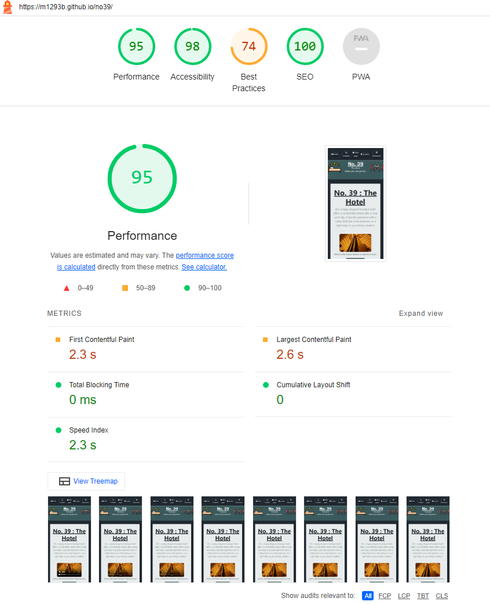
  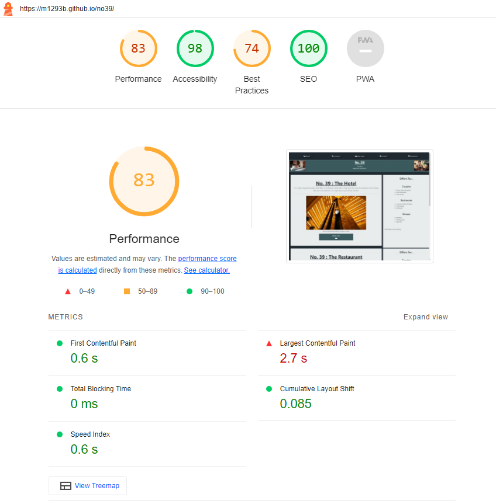
  
  ## W3C HTML
  
  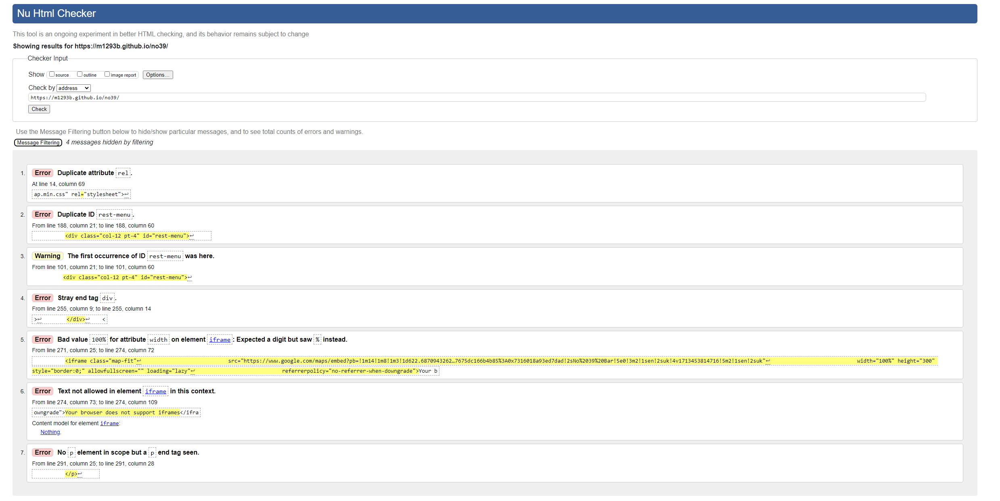

  After the initial testing, I went through the HTML files and corrected errors shown by the W3C test result.

  

  ## W3C CSS(Jigsaw)
  
  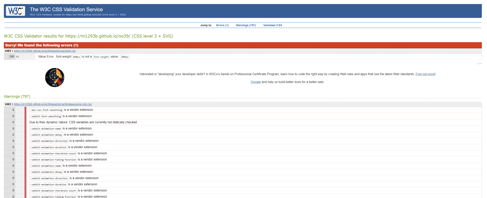

  After the initial testing, I went through the CSS file and corrected errors shown by the Jigsaw test result.

  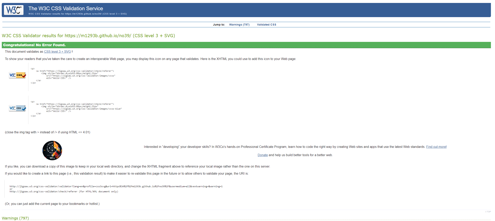

  ## Final website

  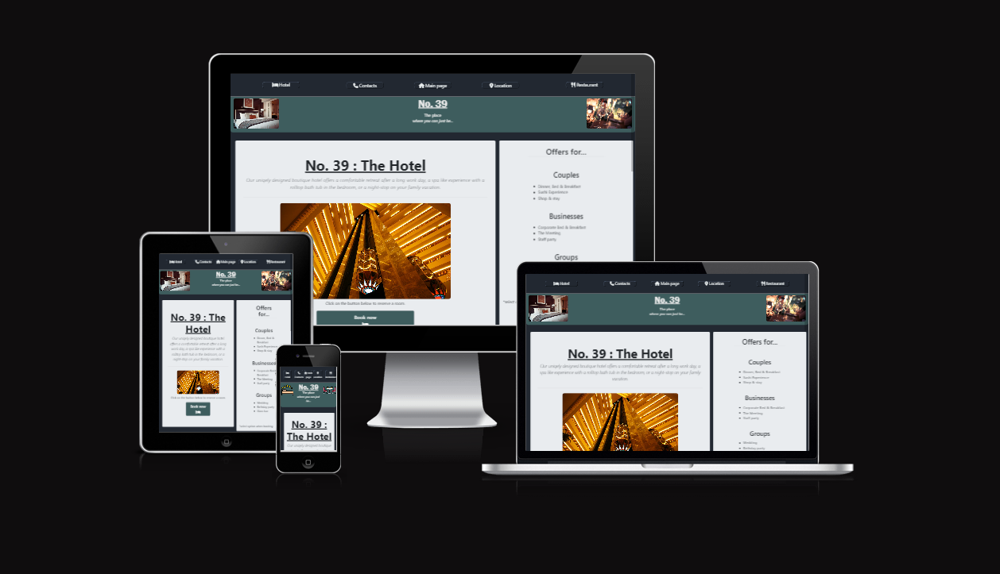
  
## Manual testing

  - User stories

  1.  First time visitor goals:
  
  - As a first time visitor, I would like to be able to understand what is the purpose of the website.

  - As I arrive to the website's main page, it is apparent that it offers accommodation and has a restaurant on-site as well.
  
  - As a first time visitor, I would like to be able to easily navigate through the pages.

  - The navigation bar is clear and visible regardless how much the user scrolled down.

  - As a first time visitor, I would like to be able to find the location information.

  - If someone just searches for "restaurants nearby" and opens my website, they would not know how nearby the venue us. For this very reason, I have included a "Location" button to take the user to the iframe that accommodates Google Maps with the venue's location set as default.

  2.  Returning visitor goals:

  - As a returning visitor, I would like to be able to comfortably find the previously visited sites.

  - The navigation bar is fixed to the top of the page, so it is available all the time.

  - As a returning visitor, I would like to be able to be able to find the contact details, regardless which page I am viewing.

  - For this reason, there is a button in the navigation section that takes the user to the contact details, regardless which page they are viewing.

  - As a returning visitor, I would like to be able to find other experiences the venue offers.

  - Both the hotel's and the restaurant's short introduction is located on the main page, which makes it easier for the user to, as an example, book a table for the day of their arrival to the hotel.

  
  3.  Frequent visitor goals:

  - As a frequent visitor, I would like to be able to easily find out if there are any updates on the packages.

  - All the offer's names show up on the main page, following the appropriate venues short introduction.

  - As a frequent visitor, I would like to be able to see the restaurant opening times.

  - The opening times sections follows the booking form, which makes it convenient for the user to have a look while booking their next visit.

  - As a frequent visitor, I would like to be able to easily book a room or a table for my party.

  - On the main page, there are a couple of options to get to the booking forms. The user could click on the button in the navigation bar, click on the picture that represents the desired venue or click on the button in the short introduction section.

## Restaurant booking form testing

  Checking mandatory fields. Goal: To have a message box popping up to tell the user they have missed to fill out a required field.

  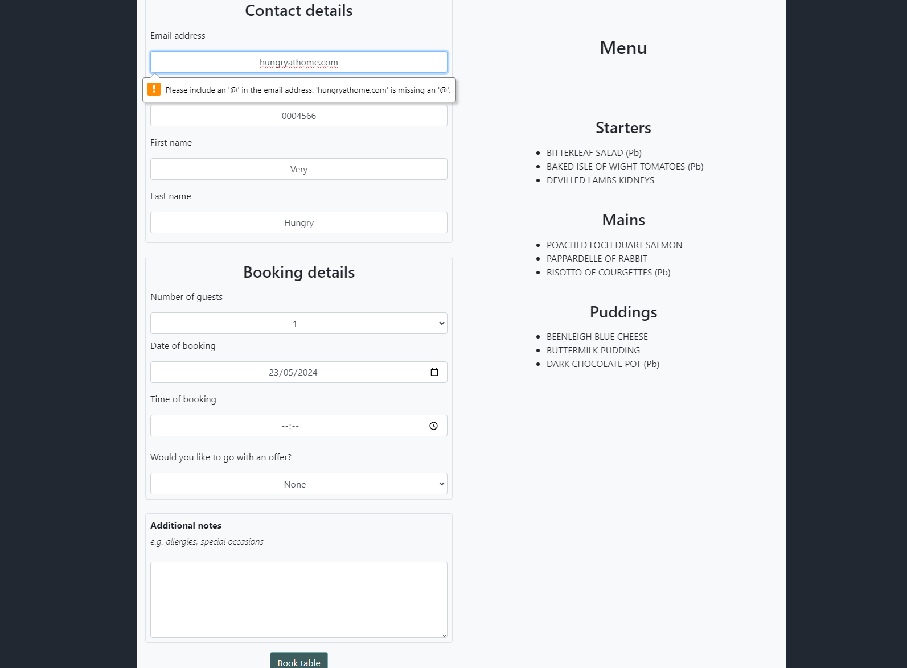

  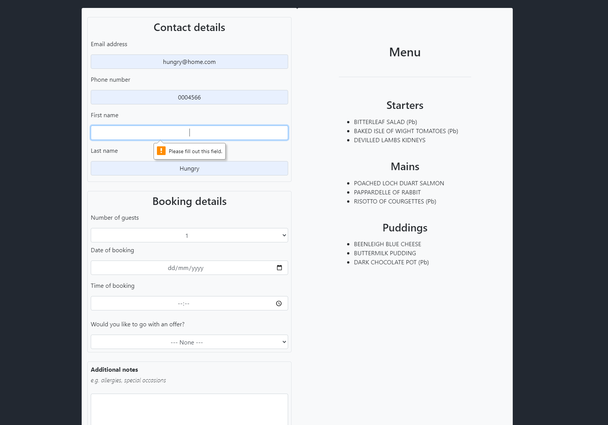

  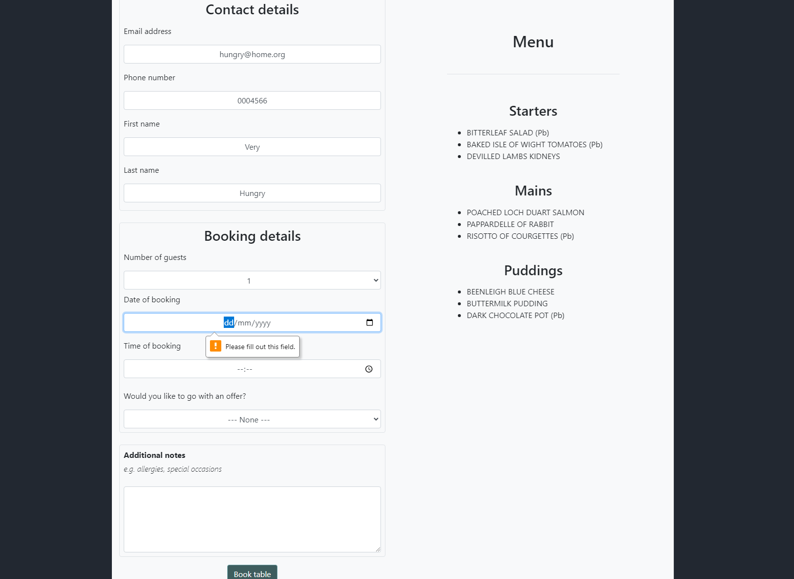

  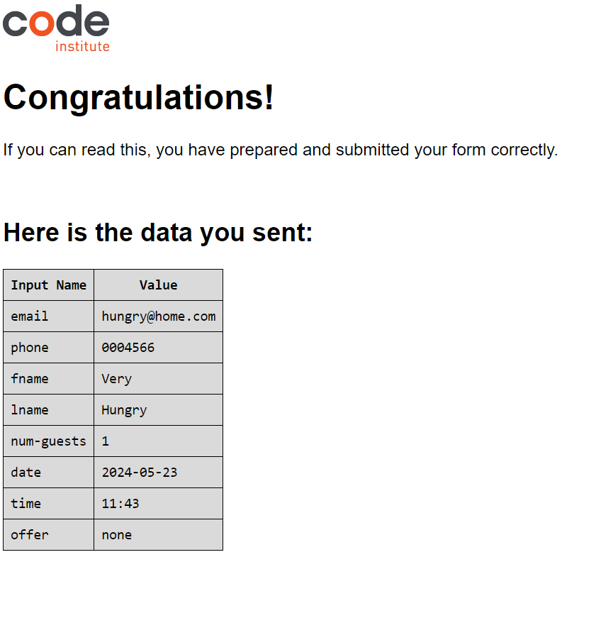

## Hotel booking form testing

  Checking mandatory fields. Goal: To have a message box popping up to tell the user they have missed to fill out a required field.

  

  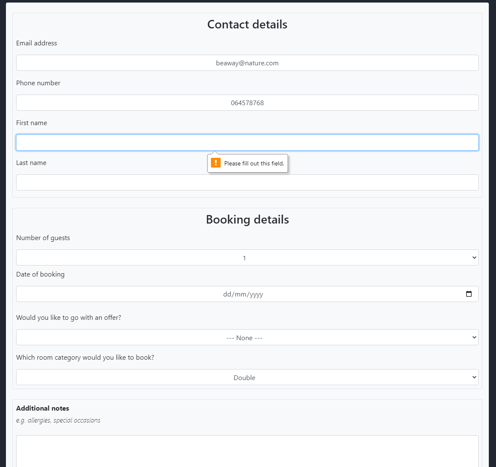

  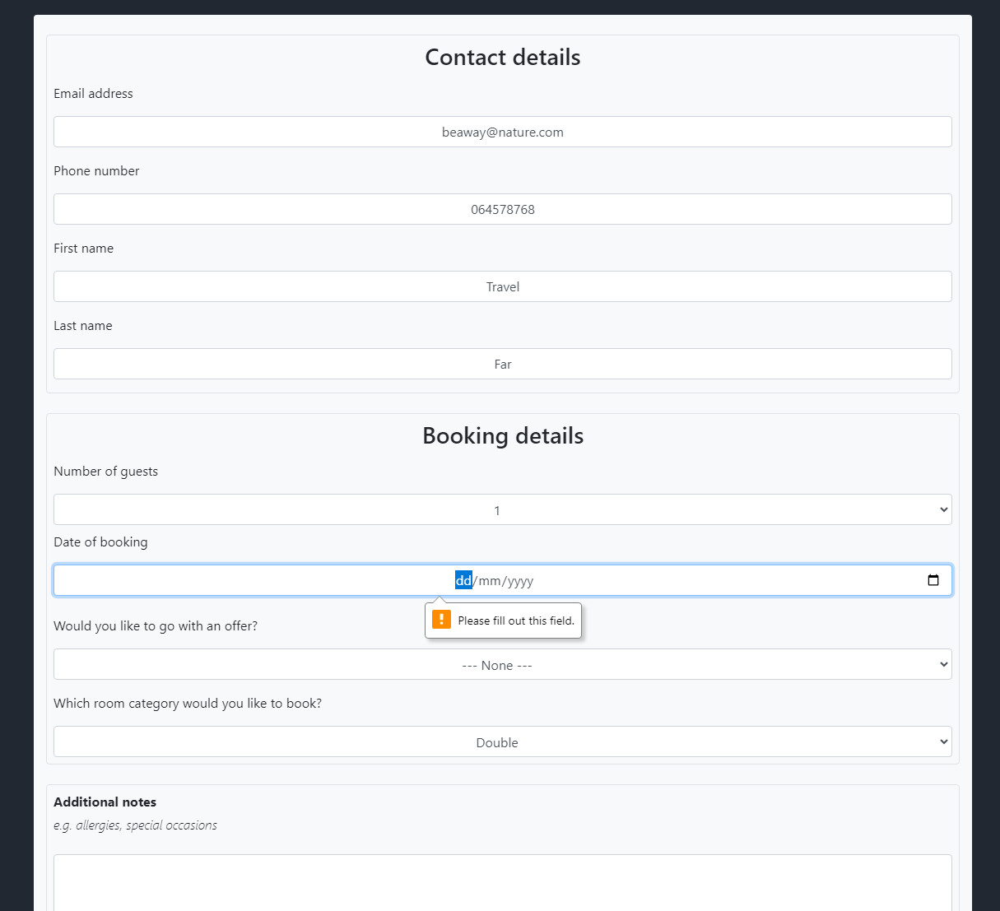

  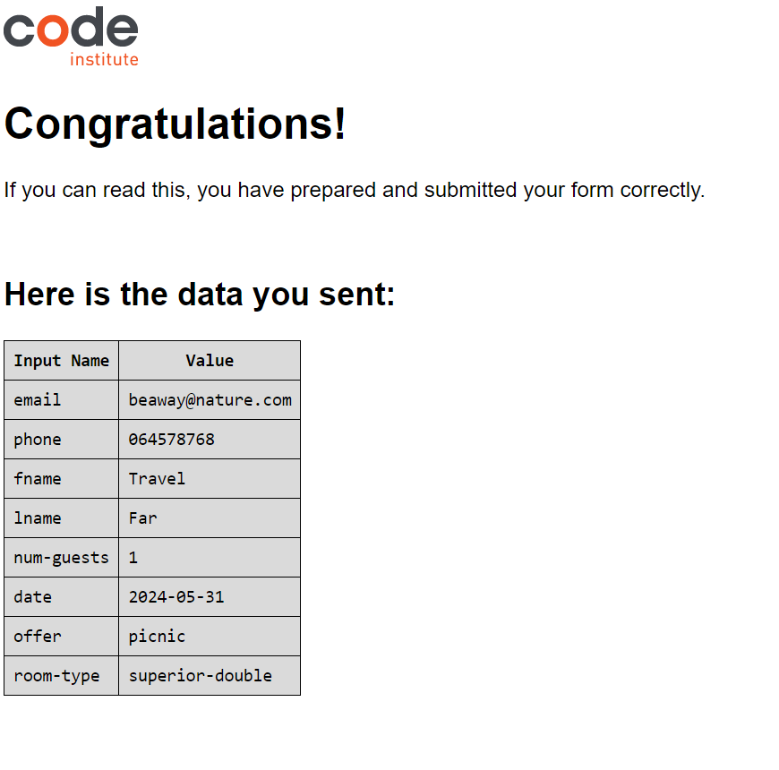   

# Credits
   
  1. ## Content

  - [The colours used for the website were found on colorhunt.com](https://colorhunt.co/palette/22283131363f76abaeeeeeee)

  2. ## Media

  - [The picture of the hotel room was found on Pexels.com. Direct link to the page I downloaded the picture from](https://www.pexels.com/photo/black-and-grey-bedspread-on-bed-and-pillow-164595/): 
  - [The video that is playing in the hotel's section, was downloaded from Pexels.com](https://www.pexels.com/video/elevators-going-up-and-down-855191/)
  - [The video that is playing in the restaurant's section, was downloaded from Pexels.com](https://www.pexels.com/video/people-eating-a-meal-at-the-restaurant-5101342/)
  - [The picture of the wineglass held up was found on Pexels.com. Direct link to the page I downloaded the picture from](https://www.pexels.com/photo/wine-glass-on-restaurant-table-225228/)
  - [The icon for the hotel was found on flaticon.com](https://www.flaticon.com/free-icon/bed_1786937?term=hotel+room&page=1&position=23&origin=search&related_id=1786937)
  - [The icon for the hotel was found on flaticon.com](https://www.flaticon.com/free-icon/dinner_9954957?term=restaurant&page=1&position=48&origin=search&related_id=9954957)
  - [Font-awesome icon was used within the anchor tag for the hotel's link](https://fontawesome.com/icons/bed?f=classic&s=solid)
  - [Font-awesome icon was used within the anchor tag for the contacts' link](https://fontawesome.com/icons/phone?f=classic&s=solid)
  - [Font-awesome icon was used within the anchor tag for the main page's link](https://fontawesome.com/icons/house?f=classic&s=solid)
  - [Font-awesome icon was used within the anchor tag for the location's link](https://fontawesome.com/icons/location-dot?f=classic&s=solid)
  - [Font-awesome icon was used within the anchor tag for the restaurants's link](https://fontawesome.com/icons/utensils?f=classic&s=solid)
  
  3. ## Code
   
  - I've got the idea of margin: 0 auto; from the "I love running" project. It is an easy way to devide the width of the screen by 3 equaly sized sections.
  - I've used form-group from Bootstrap's website as a template for my booking forms.
