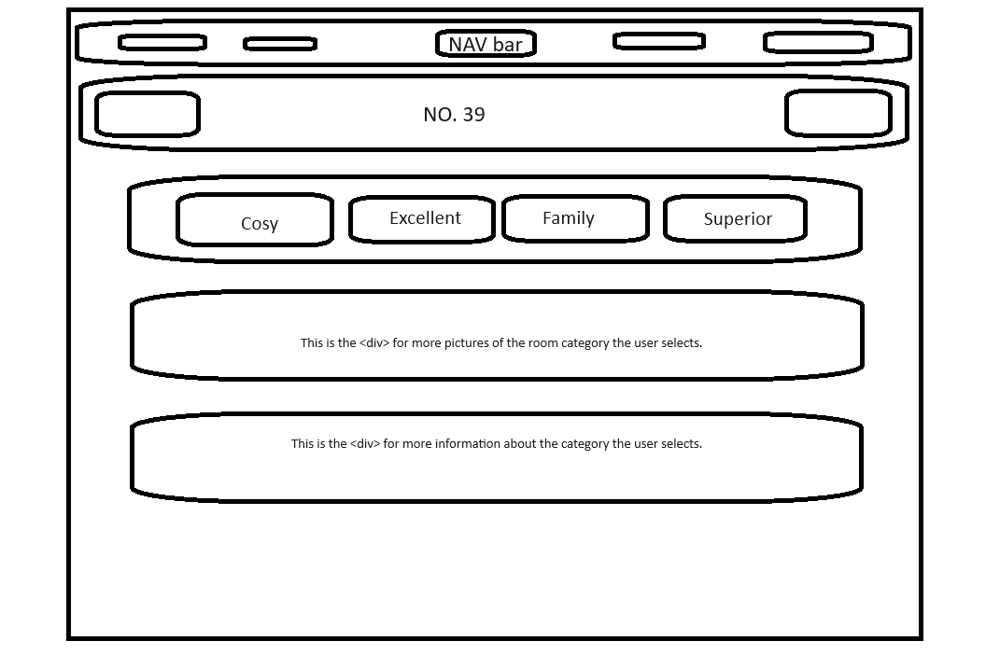
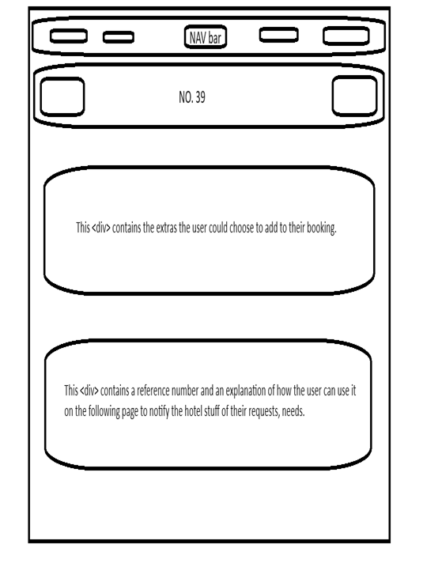
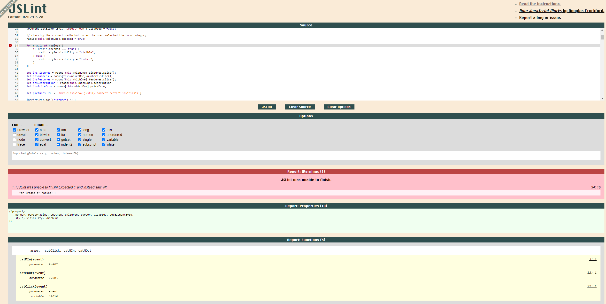
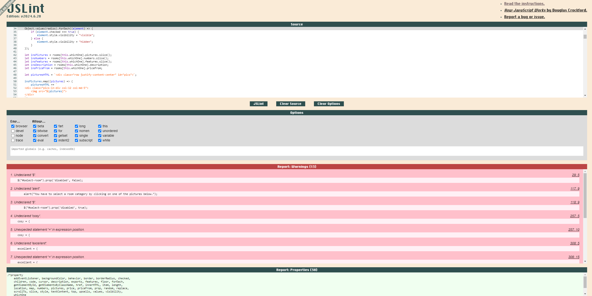
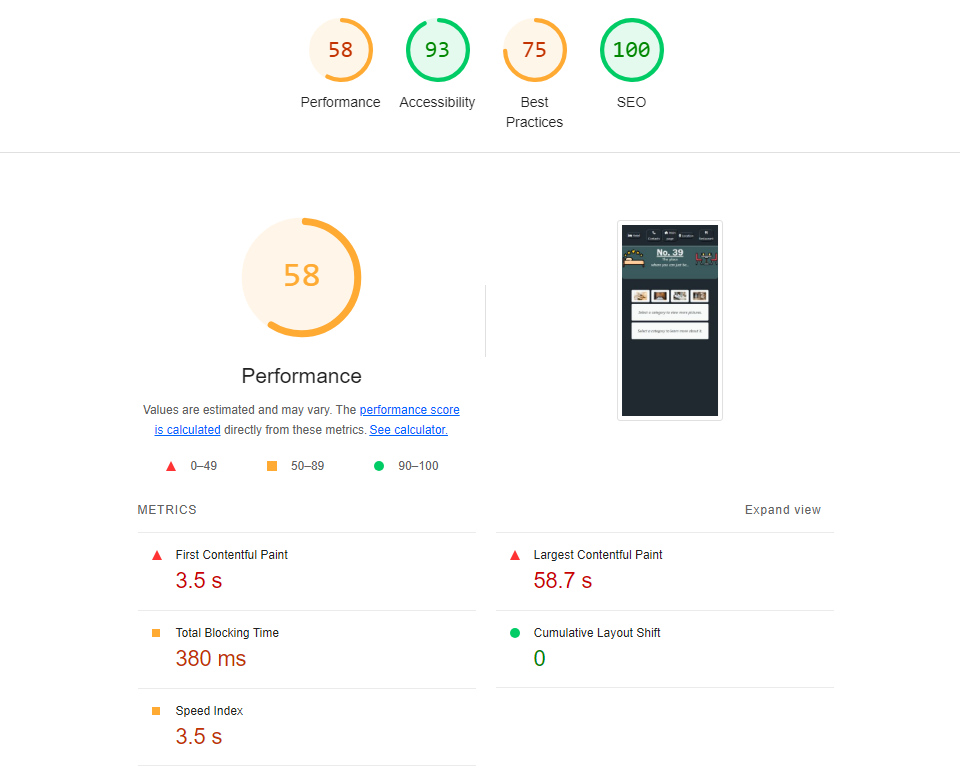
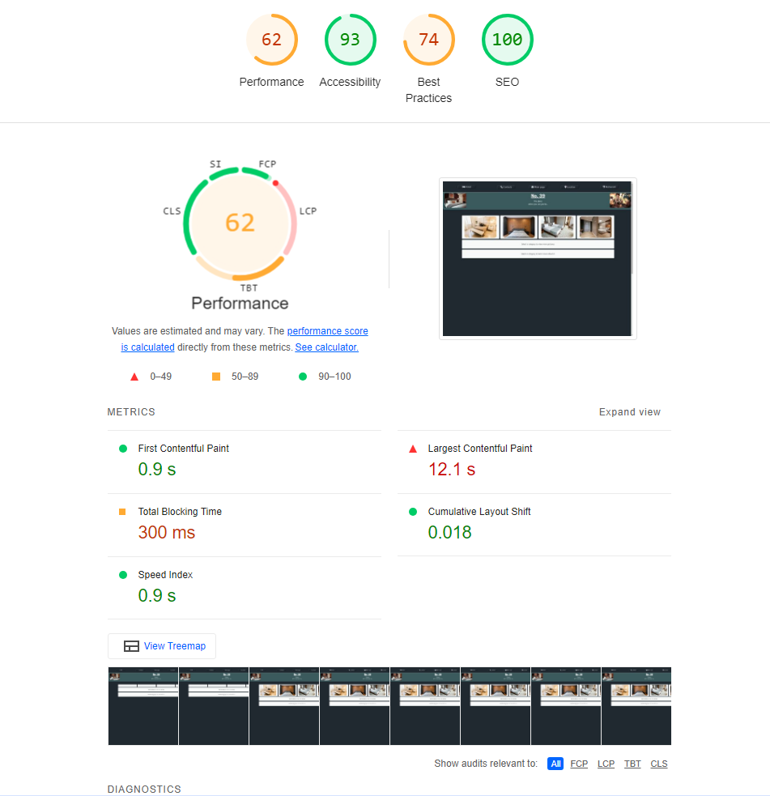
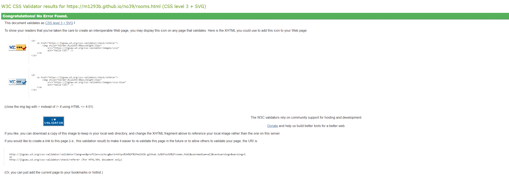
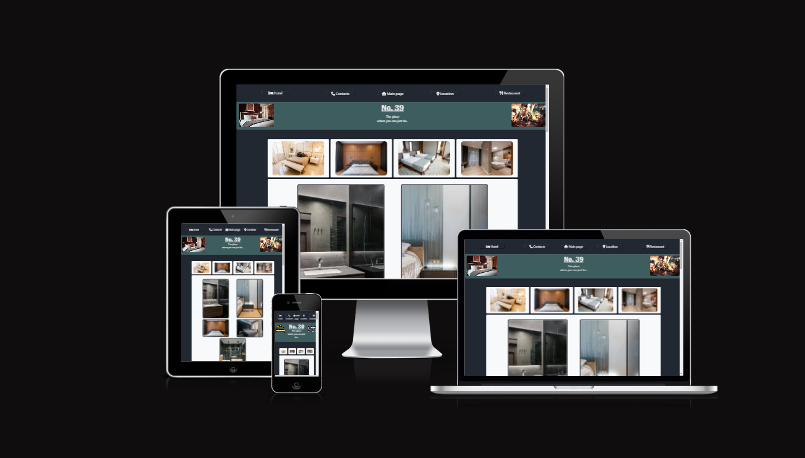
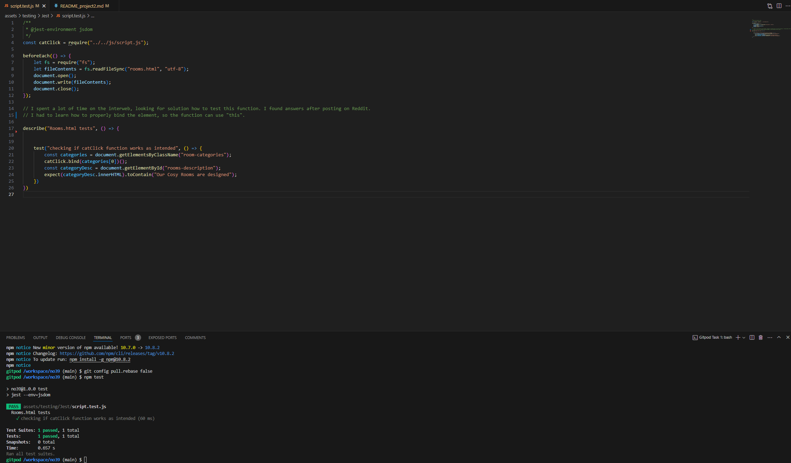

# Table of content:

  ## UX
  - User stories
  - Project goals
  - Design choices
  - Business goals
  - Developer goals
  - Wire frames

  ## Features
  - Existing features
  - Features left to be implemented

  ## Technologies used

  ## Bugs

  ## Testing
  - Testing with validators
  - Manual testing
  - Room category selection
  - Add extras

  ## Credits
  - Content
  - Media
  - Code

  ## Deployment

***

# UX

  - ## User stories
  
    ### As a Solo Traveler
    - **I want** a comfortable and affordable room with essential amenities.
    - **So that** I can have a pleasant and convenient stay without overspending.

    ### As a Business Professional
    - **I want** a room equipped with a work desk, high-speed internet, and a laptop safe.
    - **So that** I can work efficiently and securely during my stay.

    ### As a Family
    - **I want** a spacious room with separate sleeping areas for parents and children.
    - **So that** our family can enjoy a comfortable and private stay.

    ### As a Couple
    - **I want** a luxurious suite with premium amenities like a roll-top bath and balcony.
    - **So that** we can have a romantic and relaxing getaway.

    ### As an Event Organizer
    - **I want** access to meeting room rentals and airport transfers.
    - **So that** I can coordinate business events and travel logistics smoothly.

    ### As a Food Enthusiast
    - **I want** the option to reserve a table at the hotel's restaurant.
    - **So that** I can enjoy fine dining without leaving the hotel premises.

    By addressing these user stories, we ensure that No. 39 Hotel Rooms cater to a diverse range of guests, providing tailored experiences that meet their specific needs and expectations.
    
  - ## Project goals
    
    The goal of my second project is to create an interactive environment for the user where they could learn more about the room categories and other services they could purchase at the time of booking.

  - ## Design choices

    I continued to use curved borders wherever I could. I found Bootstrap's container to be quite usefull again, as it helped me neatly organise the layout, especially when displaying pictures of the rooms.

  - ## Business goals
    
    This page helps the potential guest to learn more about what the hotel could offer in terms of rooms and services.

  - ## Developer goals

    I wanted the business to achive its goal by simplifying the way how the user finds the options. I added the links to features that invites the user to buy vouchers, so e.g. family members could surprise their beloved with a present during the festive period. I have also added the option to buy packages, that include an overall discount on the total price, and makes it simpler for the potential guests to organise their stay.

  - ## Wireframes

    
    
    
    
    
    

# Features
   

  - ## Existing features
    
  * Being able to view more pictures of the rooms.
  * Get a better understanding that services the hotel can offer.
  * Option to add extras and reference the package the user has put together.

  - ## Features left to be implemented
    
  * To transfer data from the room/extras selection pages to the actual booking form, to pre-populate certain input elements.
  * A database, to process and store data that the user sent via the booking form.
  

# Technologies used


  1. Languages used:

  - HTML
  - CSS
  - JavaScript

  2. Frameworks, Libraries & Programs Used:

  - Bootstrap - Used to create boxes for the main and footer sections.
  - GitHub - Used for making my files available on the web.

  1. Websites used

  - [I used stackoverflow to check for solution when I got tired/stuck.](https://stackoverflow.com/)
  - [I used w3schools to check for correct syntax whenever I had my code stop working.](https://www.w3schools.com/)
  - [The website I used to check if my website is responsive. I also included a screenshot in the testing section.](https://ui.dev/)
  - [I used Bootstrap's website a lot, especially to get a better idea how to align items.](https://getbootstrap.com/)
  - [I used Pexels to find appropriate photos and videos to fit in the subject of my website.](https://www.pexels.com)

# Bugs


  I had a bug, when I created a function for the EventListener of the "Add" buttons on the last page. I couldn't get it to work so it would add a specific code to
  the reference number whenever the user clicked on the button, and would remove when the user clicked on the same button. It kept adding the code twice, and after a while I dug deep into my memory and realised, the "click" event counts twice. I changed it to "mouseup", and it works just fine.
    


# Testing

## Testing with validators

  ## JSLint

  

  - On this second screenshot, we can see that JSLint had issues with how I declared variables inside the Array. I am unsure what JSLint did not like. I corrected everything I could, except the for (radio of radios) loop, as I found that the best way to get the values of the object. I hope that is fine.

  

  ## Lighthouse
      
    
  
  
  ## W3C HTML
  
  

  ## W3C CSS(Jigsaw)
  
  

  ## W3C CSS(Jigsaw)
  
  

  ## Final website

  


## Manual testing

  ### User Stories

  #### As a Solo Traveler
  - **Story**: I want a comfortable and affordable room with essential amenities so that I can have a pleasant and convenient stay without overspending.
  - **Test Result**: The Cosy Room category fulfills this requirement with its king bed, walk-in shower, minibar, and complimentary coffee and tea. Prices start from £120.

  #### As a Business Professional
  - **Story**: I want a room equipped with a work desk, high-speed internet, and a laptop safe so that I can work efficiently and securely during my stay.
  - **Test Result**: The Excellent Room category meets this need, offering a super king bed, work desk, wired and wireless internet connection, and a laptop safe.

  #### As a Family
  - **Story**: I want a spacious room with separate sleeping areas for parents and children so that our family can enjoy a comfortable and private stay.
  - **Test Result**: The Family Room category addresses this need with a super king bed for parents, two single beds in a separate connected room, and a seating area with board games.

  #### As a Couple
  - **Story**: I want a luxurious suite with premium amenities like a roll-top bath and balcony so that we can have a romantic and relaxing getaway.
  - **Test Result**: The Superior Suite provides an emperor bed, roll-top bath, double walk-in shower, balcony, and minibar.

  #### As an Event Organizer
  - **Story**: I want access to meeting room rentals and airport transfers so that I can coordinate business events and travel logistics smoothly.
  - **Test Result**: The website offers meeting room rentals at customized discounted rates and airport transfers for £80, available as extras with the Excellent Room category.

  #### As a Food Enthusiast
  - **Story**: I want the option to reserve a table at the hotel's restaurant so that I can enjoy fine dining without leaving the hotel premises.
  - **Test Result**: Users can reserve a table at the restaurant via the Restaurant's page or request it in the additional notes section during booking.

## Automated testing

  I spent a lot of time on the internet, looking for a solution how to test this function. I found the answer after posting on Reddit.
  I had to learn how to properly bind the element, so the function can use "this".

  -  

## Room category selection testing

  - The user is able to see which category they are about to select and view more information about once they have hovered over one of the pictures.
  - The user is able to switch between categories without an issue. The pictures could load faster, so I will look into a fix for that. 

## Add extras

  - The user can add either of the extras without an issue. Everytime the user adds an extra, the reference number gets updated.
  - The user can remove the extra service they added earlier. Everytime the user removes an extra, the reference number gets updated.
# Credits
   
  1. ## Content

  - [The colours used for the website were found on colorhunt.com](https://colorhunt.co/palette/22283131363f76abaeeeeeee)


  2. ## Media

  - [The picture of the hotel room was found on Pexels.com. Direct link to the page I downloaded the picture from](https://www.pexels.com/photo/cozy-modern-bedroom-3144580/) 
  - [The picture of the hotel room was found on Pexels.com. Direct link to the page I downloaded the picture from](https://www.pexels.com/photo/interior-of-modern-bedroom-with-soft-bed-and-wooden-walls-6284232/)
  - [The picture of the hotel room was found on Pexels.com. Direct link to the page I downloaded the picture from](https://www.pexels.com/photo/a-warm-and-comfortable-place-3688261/)
  - [The picture of the hotel room was found on Pexels.com. Direct link to the page I downloaded the picture from](https://www.pexels.com/photo/apartment-interior-with-bed-near-windows-with-curtains-6585757/)
  - [The picture of the hotel room was found on Pexels.com. Direct link to the page I downloaded the picture from](https://www.pexels.com/photo/interior-of-cozy-bedroom-with-comfy-bed-and-tv-hanging-over-chest-of-drawers-6527066/)
  - [The picture of the hotel room was found on Pexels.com. Direct link to the page I downloaded the picture from](https://www.pexels.com/photo/black-and-grey-bedspread-on-bed-and-pillow-164595/)
  - [The picture of the hotel room was found on Pexels.com. Direct link to the page I downloaded the picture from](https://www.pexels.com/photo/black-laptop-placed-on-table-271618/)
  - [The picture of the hotel room was found on Pexels.com. Direct link to the page I downloaded the picture from](https://www.pexels.com/photo/stylish-bathroom-with-glass-elements-in-apartment-6032203/)
  - [The picture of the hotel room was found on Pexels.com. Direct link to the page I downloaded the picture from](https://www.pexels.com/photo/made-bed-in-spacious-bedroom-with-air-conditioner-6316054/)
  - [The picture of the hotel room was found on Pexels.com. Direct link to the page I downloaded the picture from](https://www.pexels.com/photo/interior-details-of-contemporary-bedroom-with-bedside-table-and-wardrobe-6933760/)
  - [The picture of the hotel room was found on Pexels.com. Direct link to the page I downloaded the picture from](https://www.pexels.com/photo/home-design-26571204/)
  - [The picture of the hotel room was found on Pexels.com. Direct link to the page I downloaded the picture from](https://www.pexels.com/photo/room-with-bed-and-wooden-floor-1743229/)
  - [The picture of the hotel room was found on Pexels.com. Direct link to the page I downloaded the picture from](https://www.pexels.com/photo/two-single-beds-in-well-lit-room-2029722/)
  - [The picture of the hotel room was found on Pexels.com. Direct link to the page I downloaded the picture from](https://www.pexels.com/photo/clear-glass-shower-room-271631/)
  - [The picture of the hotel room was found on Pexels.com. Direct link to the page I downloaded the picture from](https://www.pexels.com/photo/a-simple-bedroom-3659683/)
  - [The picture of the hotel room was found on Pexels.com. Direct link to the page I downloaded the picture from](https://www.pexels.com/photo/spacious-bathroom-with-modern-trendy-design-6032424/)
  - [The picture of the hotel room was found on Pexels.com. Direct link to the page I downloaded the picture from](https://www.pexels.com/photo/interior-of-stylish-bathroom-in-cottage-6032425/)
  - [The picture of the hotel room was found on Pexels.com. Direct link to the page I downloaded the picture from](https://www.pexels.com/photo/classic-bedroom-with-armchairs-and-tv-next-to-bed-6587902/)
  - [The picture of the hotel room was found on Pexels.com. Direct link to the page I downloaded the picture from](https://www.pexels.com/photo/bathroom-interior-1457847/)
  
   
  3. ## Code
   
  - Official site like W3School and Bootstrap help to create a great lyaout that functions well.
  - StackOverflow helped me to see how others solved the issues their code had and I manage to use some of the solutions after customising them to fit my code.
  <!-- I will include some of the StackOverFlow pages in my next project, that helped me solve the bugs I had.  -->

## Deployment

  - I used GitHub for version control and to deploy my website. I also used Gitpod and its workspace to develope the website. Both of these services are connected to my Virtual Studio Code application on my PC. I have also tried "Code-server" that is hosted in a docker container on my home server, but did not had enough time to configure it properly and it was using way too much RAM so I just used VSCode on my PC.

  ### Deploying with GitHub Pages

  1. **Push your code to the `main` branch** of your GitHub repository:
      ```sh
      git add .
      git commit -m "Deploy website"
      git push origin main
      ```

  2. **Enable GitHub Pages**:
       - Go to your repository on GitHub.
       - Click on `Settings`.
       - Scroll down to the `Pages` section.
       - Under `Source`, select the branch you want to deploy (e.g., `main`) and `/root` folder.
       - Click `Save`.

  3. **Access your website**:
       - After a few minutes, your site should be available at `https://<username>.github.io/<repository-name>/`.