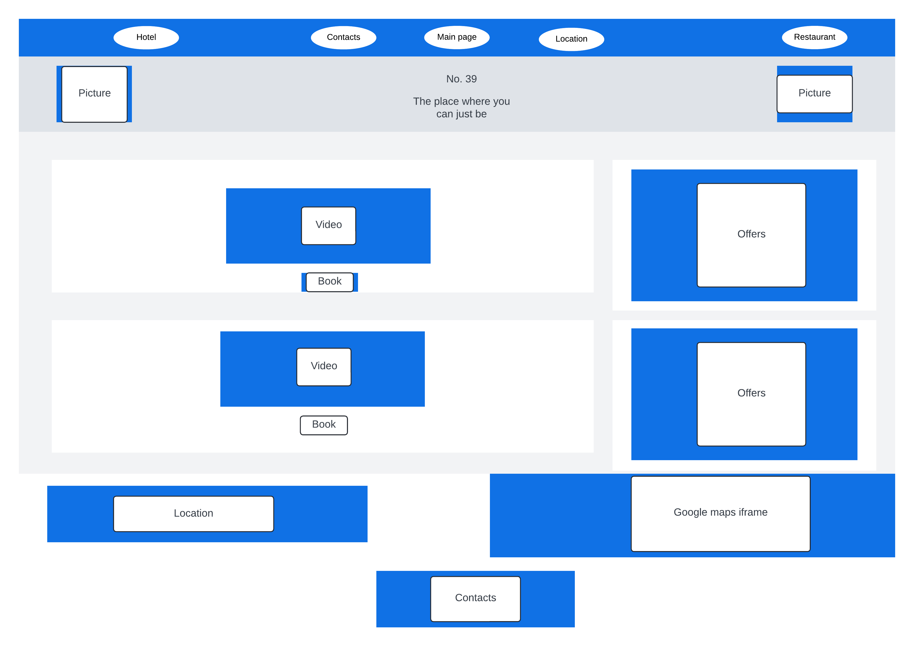
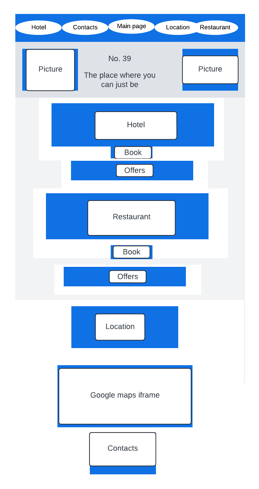
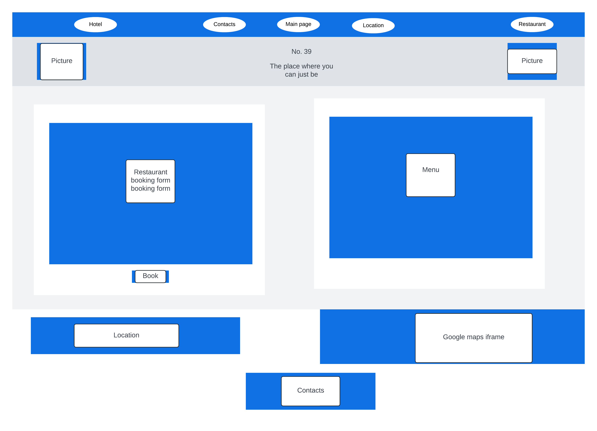

# Table of content:

  ## UX
  - User stories
  - Project goals
  - Design choices
  - Business goals
  - Developer goals
  - Wire frames

  ## Features
  - Existing features
  - Features left to be implemented

  ## Technologies used

  ## Bugs

  ## Testing
  - Testing with validators
  - Manual testing
  - Room category selection
  - Add extras

  ## Credits
  - Content
  - Media
  - Code

***

# UX

  - ## User stories
  
    ### As a Solo Traveler
    - **I want** a comfortable and affordable room with essential amenities.
    - **So that** I can have a pleasant and convenient stay without overspending.

    ### As a Business Professional
    - **I want** a room equipped with a work desk, high-speed internet, and a laptop safe.
    - **So that** I can work efficiently and securely during my stay.

    ### As a Family
    - **I want** a spacious room with separate sleeping areas for parents and children.
    - **So that** our family can enjoy a comfortable and private stay.

    ### As a Couple
    - **I want** a luxurious suite with premium amenities like a roll-top bath and balcony.
    - **So that** we can have a romantic and relaxing getaway.

    ### As an Event Organizer
    - **I want** access to meeting room rentals and airport transfers.
    - **So that** I can coordinate business events and travel logistics smoothly.

    ### As a Food Enthusiast
    - **I want** the option to reserve a table at the hotel's restaurant.
    - **So that** I can enjoy fine dining without leaving the hotel premises.

    By addressing these user stories, we ensure that No. 39 Hotel Rooms cater to a diverse range of guests, providing tailored experiences that meet their specific needs and expectations.
    
  - ## Project goals
    
    The goal of my second project is to create an interactive environment for the user where they could learn more about the room categories and other services they could purchase at the time of booking.

  - ## Design choices

    I continued to use curved borders wherever I could. I found Bootstrap's container to be quite usefull again, as it helped me neatly organise the layout, especially when displaying pictures of the rooms.

  - ## Business goals
    
    This page helps the potential guest to learn more about what the hotel could offer in terms of rooms and services.

  - ## Developer goals

    I wanted the business to achive its goal by simplifying the way how the user finds the options. I added the links to features that invites the user to buy vouchers, so e.g. family members could surprise their beloved with a present during the festive period. I have also added the option to buy packages, that include an overall discount on the total price, and makes it simpler for the potential guests to organise their stay.

<!-- Needs updating -->
  - ## Wireframes

    
    
    
    
    
    
    
    
    
<!-- until here -->

# Features
   

  - ## Existing features
    
  * Being able to view more pictures of the rooms.
  * Get a better understanding that services the hotel can offer.
  * Option to add extras and reference the package the user has put together.

  - ## Features left to be implemented
    
  * To transfer data from the room/extras selection pages to the actual booking form, to pre-populate certain input elements.
  * A database, to process and store data that the user sent via the booking form.
  

# Technologies used

  1. Languages used:

  - HTML
  - CSS
  - JavaScript

  2. Frameworks, Libraries & Programs Used:

  - Bootstrap - Used to create boxes for the main and footer sections.
  - GitHub - Used for making my files available on the web.

  1. Websites used

  - [I used stackoverflow to check for solution when I got tired/stuck.](https://stackoverflow.com/)
  - [I used w3schools to check for correct syntax whenever I had my code stop working.](https://www.w3schools.com/)
  - [The website I used to check if my website is responsive. I also included a screenshot in the testing section.](https://ui.dev/)
  - [I used Bootstrap's website a lot, especially to get a better idea how to align items.](https://getbootstrap.com/)
  - [I used Pexels to find appropriate photos and videos to fit in the subject of my website.](https://www.pexels.com)

# Bugs

  I had a bug, when I created a function for the EventListener of the "Add" buttons on the last page. I couldn't get it to work so it would add a specific code to
  the reference number whenever the user clicked on the button, and would remove when the user clicked on the same button. It kept adding the code twice, and after a while I dug deep into my memory and realised, the "click" event counts twice. I changed it to "mouseup", and it works just fine.
    

# Testing

## Testing with validators

  ## Lighthouse
      
  
  
  
  ## W3C HTML
  
  

  ## W3C CSS(Jigsaw)
  
  

  ## Final website

  

<!-- Needs updating -->
## Manual testing

  - User stories

  1.  First time visitor goals:
  
  - As a first time visitor, I would like to be able to understand what is the purpose of the website.

    - As I arrive to the website's main page, it is apparent that it offers accommodation and has a restaurant on-site as well.
  
  - As a first time visitor, I would like to be able to easily navigate through the pages.

    - The navigation bar is clear and visible regardless how much the user scrolled down.

  - As a first time visitor, I would like to be able to find the location information.

    - If someone just searches for "restaurants nearby" and opens my website, they would not know how nearby the venue us. For this very reason, I have included a "Location" button to take the user to the iframe that accommodates Google Maps with the venue's location set as default.

  2.  Returning visitor goals:

  - As a returning visitor, I would like to be able to comfortably find the previously visited sites.

    - The navigation bar is fixed to the top of the page, so it is available all the time.

  - As a returning visitor, I would like to be able to be able to find the contact details, regardless which page I am viewing.

    - For this reason, there is a button in the navigation section that takes the user to the contact details, regardless which page they are viewing.

  - As a returning visitor, I would like to be able to find other experiences the venue offers.

    - Both the hotel's and the restaurant's short introduction is located on the main page, which makes it easier for the user to, as an example, book a table for the day of their arrival to the hotel.

  
  3.  Frequent visitor goals:

  - As a frequent visitor, I would like to be able to easily find out if there are any updates on the packages.

    - All the offer's names show up on the main page, following the appropriate venues short introduction.

  - As a frequent visitor, I would like to be able to see the restaurant opening times.

    - The opening times sections follows the booking form, which makes it convenient for the user to have a look while booking their next visit.

  - As a frequent visitor, I would like to be able to easily book a room or a table for my party.

    - On the main page, there are a couple of options to get to the booking forms. The user could click on the button in the navigation bar, click on the picture that represents the desired venue or click on the button in the short introduction section.
<!-- until here -->

## Room category selection testing

  - The user is able to see which category they are about to select and view more information about once they have hovered over one of the pictures.
  - The user is able to switch between categories without an issue. The pictures could load faster, so I will look into a fix for that. 

## Add extras

  - The user can add either of the extras without an issue. Everytime the user adds an extra, the reference number gets updated.
  - The user can remove the extra service they added earlier. Everytime the user removes an extra, the reference number gets updated.

<!-- Needs updating -->
# Credits
   
  1. ## Content

  - [The colours used for the website were found on colorhunt.com](https://colorhunt.co/palette/22283131363f76abaeeeeeee)

  2. ## Media

  - [The picture of the hotel room was found on Pexels.com. Direct link to the page I downloaded the picture from](https://www.pexels.com/photo/black-and-grey-bedspread-on-bed-and-pillow-164595/): 
  - [The video that is playing in the hotel's section, was downloaded from Pexels.com](https://www.pexels.com/video/elevators-going-up-and-down-855191/)
  - [The video that is playing in the restaurant's section, was downloaded from Pexels.com](https://www.pexels.com/video/people-eating-a-meal-at-the-restaurant-5101342/)
  - [The picture of the wineglass held up was found on Pexels.com. Direct link to the page I downloaded the picture from](https://www.pexels.com/photo/wine-glass-on-restaurant-table-225228/)
  - [The icon for the hotel was found on flaticon.com](https://www.flaticon.com/free-icon/bed_1786937?term=hotel+room&page=1&position=23&origin=search&related_id=1786937)
  - [The icon for the hotel was found on flaticon.com](https://www.flaticon.com/free-icon/dinner_9954957?term=restaurant&page=1&position=48&origin=search&related_id=9954957)
  - [Font-awesome icon was used within the anchor tag for the hotel's link](https://fontawesome.com/icons/bed?f=classic&s=solid)
  - [Font-awesome icon was used within the anchor tag for the contacts' link](https://fontawesome.com/icons/phone?f=classic&s=solid)
  - [Font-awesome icon was used within the anchor tag for the main page's link](https://fontawesome.com/icons/house?f=classic&s=solid)
  - [Font-awesome icon was used within the anchor tag for the location's link](https://fontawesome.com/icons/location-dot?f=classic&s=solid)
  - [Font-awesome icon was used within the anchor tag for the restaurants's link](https://fontawesome.com/icons/utensils?f=classic&s=solid)
  <!-- until here -->
  3. ## Code
   
  - Official site like W3School and Bootstrap help to create a great lyaout that functions well.
  - StackOverflow helped me to see how others solved the issues their code had and I manage to use some of the solutions after customising them to fit my code.
